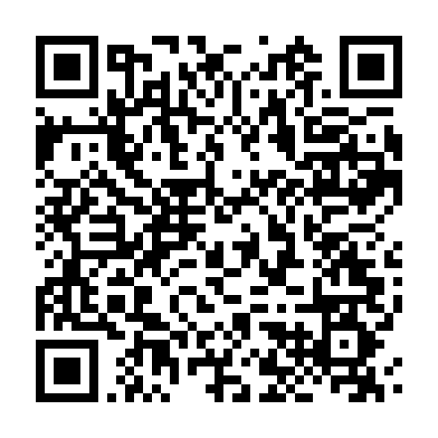

# Rune3DS

A minimal 3DS on-device catalog client. Browse, search, queue, and install content with a clean black-and-white interface, live theming, and New 3DS performance options.

## Features

- Minimal Rune UI with immediate theme previews
- Custom wallpapers from `/3ds/Rune3DS/backgrounds/`
- Direct-socket content downloads on New 3DS
- 804 MHz + L2 cache + Core 2 CIA writer on New 3DS
- 800px wide top-screen mode for New 3DS
- Live download speed, ETA, and transfer stage
- Experimental RuneFetch background stream install and CIA caching for companion sysmodule users
- Notification LED progress feedback during installs
- Queue reordering and auto-shutdown after install
- Old 3DS / 2DS compatibility

## Installing

Scan the QR code with **FBI > Remote Install > Scan QR Code**:


Or grab `Rune3DS.cia` from [Releases](../../releases) and install manually.

### Updating

Use **Universal-Updater** on your 3DS. Add the Rune3DS UniStore:



The QR contains the Rune3DS UniStore URL.

## Wallpapers

Drop PNG or JPEG files in `/3ds/Rune3DS/backgrounds/`. Go to **Settings > Background image** to pick one, then adjust dimming.

## RuneFetch

Rune3DS can write experimental background jobs for the optional RuneFetch Luma sysmodule. On a title details screen, press **L** to queue a RuneFetch job and launch the sysmodule. RuneFetch defaults to stream install on New 3DS / New 2DS and CIA cache mode on Old 3DS / Old 2DS. Settings > RuneFetch lets you switch modes. Stream mode cannot be safely canceled after install starts; reboot the console if you need to stop it.

## Requirements

- Nintendo 3DS family system with Luma3DS custom firmware
- FBI or another CIA installer

New 3DS gets the enhanced path. Old 3DS and 2DS use a compatible fallback.

## Building

You need devkitARM, libctru, Citro2D/Citro3D, makerom, bannertool, Perl, Python 3, and mbedTLS. `source/hsapi_auth.c` is local-only and is not committed.

```sh
perl build.pl --target release --configure \
  'release,targets=cia,update_base=https://example.invalid/update,nb_base=https://example.invalid/nbapi,cdn_base=https://example.invalid/content,site_url=https://example.invalid'
perl build.pl --target release
```

Output is `Rune3DS.cia`.

## Credits

Rune3DS is maintained by **p0mpurin**. Licensed under GPLv3.
