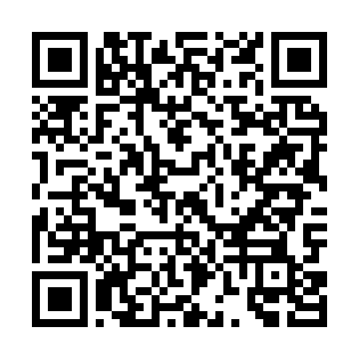

# Nocturne

A 3DS homebrew client for hShop. Browse, search, and install games, updates, DLC, themes, and VC titles. Forked from 3hs with a dark OLED theme, faster downloads, and QoL tweaks.

Nocturne is an unofficial community fork. It is not maintained or supported by the hShop team.

## What's different

- Wallpaper-based theming with pink accents
- Smoother animations on menus, popups, and progress bars
- Custom wallpapers from `/3ds/3hs/backgrounds/`
- Direct-socket CDN downloads on New 3DS (skips Nintendo's HTTP service)
- 804 MHz + L2 cache + Core 2 CIA writer on New 3DS
- 800px wide top-screen mode for New 3DS
- Live download speed, ETA, and transfer stage
- Notification LED progress feedback during installs
- Size badges next to titles and queue reordering
- Auto-shutdown after install completes (toggle in Settings)
- Old 3DS / 2DS compatibility

## Installing

Scan the QR code with **FBI > Remote Install > Scan QR Code**:



Or grab the CIA from [Releases](../../releases) and install manually.

### Updating

Use **Universal-Updater** on your 3DS. Add the Nocturne UniStore:


Or add this URL to Universal-Updater manually:

```
https://raw.githubusercontent.com/p0mpurin/just-an-hshop-fork/main/universal-updater/nocturne.unistore
```

## Wallpapers

Drop PNG or JPEG files in `/3ds/3hs/backgrounds/`. Go to **Settings > Background image** to pick one, then adjust dimming.

## Requirements

- Nintendo 3DS family system with Luma3DS custom firmware
- FBI or another CIA installer

New 3DS gets the enhanced path (804 MHz, L2 cache, Core 2 writer, direct CDN). Old 3DS and 2DS use a safe fallback.

## Building

You need devkitARM, libctru, Citro2D/Citro3D, makerom, bannertool, Perl, Python 3, and mbedTLS. `source/hsapi_auth.c` is not included, supply it from the official 3hs source archive.

```sh
perl build.pl --target release --configure \
  'release,targets=cia,update_base=https://download2.erista.me/3hs,nb_base=https://hshop.erista.me/nbapi,cdn_base=http://dl.hshopusercontent.com,site_url=https://hshop.erista.me'
perl build.pl --target release
```

Output is `3hs.cia`.

## Credits

Nocturne is maintained by **p0mpurin**, based on 3hs by the hShop development team. Licensed under GPLv3.
